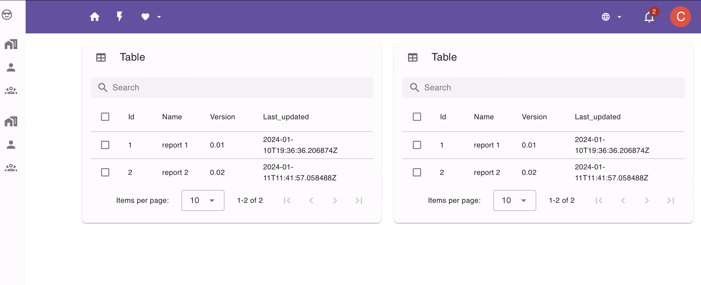

<div align="center">

# Django-Nuxt-FastAPI-PostgreSQL-Nginx

A stack to quickly make web apps for AI-related applications.

      

</div>

## Tech Stack

- __Django:__ This is the backbone of the backend API, and the packages installed are specified in the _requirements.txt_ file inside the __backend__ folder.

- __Nuxt__:__ The __frontend__ library in use using __Nuxt.js__ framework.  __Nuxt.js__ is Vue + Next and is a very popular framework in 2023 due to its simplicity. This was created via ``npx nuxi@latest``. The things pre-installed can be found in __package.json__.  __Vuetify__ is used for styling.

  If you want to install more packages, simply `yarn add [pkg]` locally at the `frontend` directory.  Then observe that `package.json` got changed.  Docker will pick it up and install it on the container once you `docker-compose build` again.  If things do not install inside the container properly, simply delete all the associated volumes and images, delete the __node_modules__ folders, and `docker-compose build` from scratch.  It works well for me.

- __Nginx:__ This is the server for the Docker-Compose testing build. The default configuration in use can be found at the __nginx/nginx.conf__ file.  Serves Django's static and media files as well.  In the __Nginx__, I have set such that Django can be accessed via `api`, `admin`, and `ws`(websocket).  See conf for details.

- __PostgreSQL:__ This is the default configured database for this repository.  Pgadmin is pre-installed in the __docker-compose.yml__

- __Fastapi:__  Refers to the __model__ folder for handling API access to deep learning models or large language models.

## Screenshot



## Install (Run) with Docker

1. Since I cannot share my `.env.dev` file with you guys, I have created an example. Rename `.env-example` to `.env.dev`

1. Run Docker-Compose:

    ```bash
    docker-compose up -d --build
    ```

    Congratulations !!! The app should be up and running. To access the __Nuxt__ frontend go to [localhost:8080](http://localhost:8080), and to access the __Django__ backend go to [localhost:8080/api](http://localhost:8080/api), and to access the __Fastapi__ go to [localhost:8080/fastapi/docs](http://localhost:8080/fastapi/docs/).   I have disabled all ports such as 3000, 8000, and 8001, so everything is managed by nginx.

1. To create a super user:

    ```bash
    docker exec -it [container id of the django] python manage.py createsuperuser
    ```

    You can get the container ID from `docker container list`

    [localhost:8080/admin](http://localhost:8080/admin) is the URL path that redirects to the Django Admin.  I highly recommend you use this URL, as it's very good for managing models.

    You do the same way every time you create models in Django.  

## Docker-Compose

This repository is divided into 4 main folders. These folders are:

- __backend:__ Has the Django project created with ``django-admin startproject``.

- __frontend:__ Has the React project been created with ``npx nuxt@latest``

- __nginx:__ Has the Dockerfile used in the __docker-compose.yml__ file and the nginx config.

- __model:__ Has the Dockerfile installing uvicorn and Fastapi.

Enter shell for the specified container (must be running)

```sh
$> docker exec -it <container-name> sh
```

Containers, Services and Ports

| Container  | Service | Host Port | Docker Port |
| ---------- | ------- | --------- | ----------- |
| dev-django | django  | 8000      | 8000        |
| dev-react  | react   | 3000      | 3000        |
| dev-db     | db      | 5432      | 5432        |
| dev-fastapi| fastapi | 8001      | 8001        |
| dev-nginx  | nginx   | 8080      | 80          |

## Deployment

The idea is that to deploy to some server/cloud, we only build the images in local machines, and push these images to Dockerhub and any registry.  In the production machine (e.g., Azure), it should **only** have one __docker-compose.yml__ file along with a __.env[.dev|.prod]__ file.  **You do not clone the GitHub repo in the production machine**.     Every time we commit our GitHub, it executes __github actions__ that:

1. pull the latest git repo,
2. call `docker-compose build`,
3. push these images to Dockerhub or any registry, and then
4. ssh into Azure, and tell Azure to `docker-compose pull` and `docker-compose up -d`.

In addition, you can replace some services with what's available in the cloud for ease of management.  For example, consider replacing postgresql with Azure database that supports postgresql or consider removing nginx since Azure supports connection between containers.   For fastapi, you can consider using gateway or function services provided by Azure.  Basically, when you fully used cloud services, you will later left with only the frontend and backend in the production machine.   But in the development machine, you will still used everything above for compiling.

For sample __docker-compose.yml__ I used in the Azure VM, see the __archives__ folder.  Note that I removed all `.build` and `volumes` since both of them are not required in production.

For sample GitHub actions, see this repository workflow YML file.


## Useful Links

There is nothing original here; I simply collect the best practices from the best.  Some GitHubs are outdated so I have to update them.

- Github repo of sunilale0: [sunilale0/django-postgresql-gunicorn-nginx-dockerized](https://github.com/sunilale0/django-postgresql-gunicorn-nginx-dockerized/blob/master/README.md#nginx)

- Github repo to Dockerize Django + MySQL + Nginx + React js: [Ceci-Aguilera/django-react-nginx-mysql-docker](https://github.com/Ceci-Aguilera/django-react-nginx-mysql-docker)

- Michael Herman's article on testdriven.io: [dockerizing-django-with-postgres-gunicorn-and-nginx](https://testdriven.io/blog/dockerizing-django-with-postgres-gunicorn-and-nginx/)

- Coby's GitHub - [https://github.com/cglusky/docker-django-react](https://github.com/cglusky/docker-django-react)
