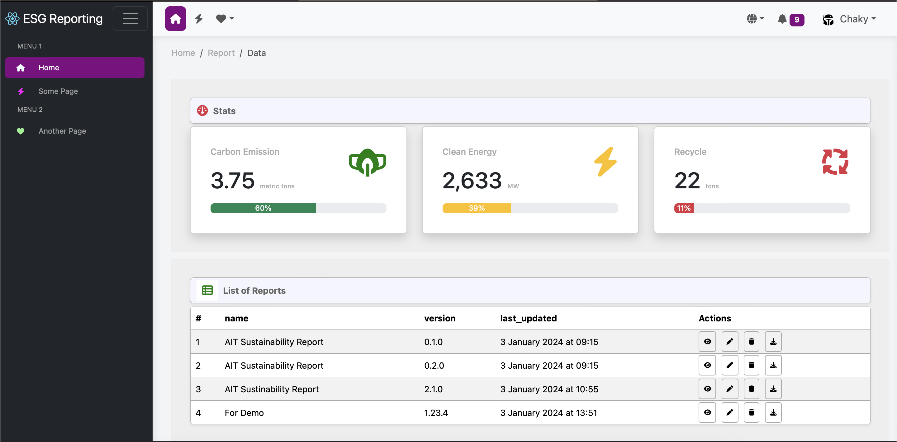
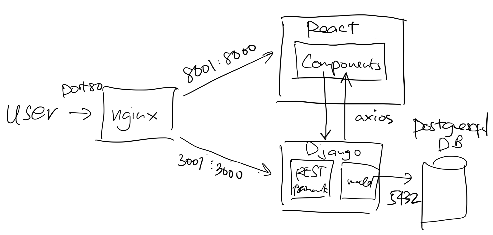

<div align="center">

# React Django

       

</div>

## Tech Stack

- __Django:__ This is the backbone of the backend API, and the packages installed are specified in the _requirements.txt_ file inside the __backend__ folder.

- __React:__ The __frontend__ library in use using __Next.js__ framework.  __Next.js__ is more robust and recommended over the classic React. This was created via ``npx create-next-app``. The things pre-installed can be found in __package.json__.

  If you want to install more packages, simply `npm install [pkg]` locally at the `frontend` directory.  Then observe that `package.json` got changed.  Docker will pick it up and install it on the container once you `docker-compose build` again.  If things do not install inside the container properly, simply delete all the associated volumes and images, delete the __node_modules__ folders, and `docker-compose build` from scratch.  It works well for me.

- __Nginx:__ This is the server for the Docker-Compose testing build. The default configuration in use can be found at the __nginx/nginx.conf__ file.  Serves Django's static and media files as well.  In the __Nginx__, I have set such that Django can be accessed via `api`, `admin`, and `ws`(websocket).  See conf for details.

- __PostgreSQL:__ This is the default configured database for this repository.  Pgadmin is pre-installed in the __docker-compose.yml__

- __React-Bootstrap:__ Everything is styled with react-bootstrap.  Please only use the styles given by https://react-bootstrap.github.io.  For custom css, put them in __index.scss__.  But try to minimize custom css as much as possible.

- __Fastapi:__  Refers to the __model__ folder for handling API access to deep learning models or large language models.

## Screenshot



## Architecture



## Install (Run) with Docker

1. Since I cannot share my `.env.dev` file with you guys, I have created an example. Rename `.env-example` to `.env.dev`

1. Run Docker-Compose:

    ```bash
    docker-compose up -d --build
    ```

    Congratulations !!! The app should be up and running. To access the __React__ frontend go to [localhost:8080](http://localhost:8080), and to access the __Django__ backend go to [localhost:8080/api](http://localhost:8080/api), and to access the __Fastapi__ go to [localhost:8080/fastapi/docs](http://localhost:8080/fastapi/docs/)

2. To create a super user:

    ```bash
    docker exec -it [container id of the django] python manage.py createsuperuser
    ```

    You can get the container ID from `docker container list`

    [localhost:8080/admin](http://localhost:8080/admin) is the URL path that redirects to the Django Admin.  I highly recommend you use this URL, as it's very good for managing models.

    You do the same way every time you create models in Django.  

## Docker-Compose

This repository is divided into 4 main folders. These folders are:

- __backend:__ Has the Django project created with ``django-admin startproject``.

- __frontend:__ Has the React project been created with ``npx create-react-app``

- __nginx:__ Has the Dockerfile used in the __docker-compose.yml__ file and the default config to run Django + React.

- __model:__ Has the Dockerfile installing uvicorn and Fastapi.

Enter shell for the specified container (must be running)

```sh
$> docker exec -it <container-name> sh
```

Containers, Services and Ports

| Container  | Service | Host Port | Docker Port |
| ---------- | ------- | --------- | ----------- |
| dev-django | django  | 8000      | 8000        |
| dev-react  | react   | 3000      | 3000        |
| dev-db     | db      | 5432      | 5432        |
| dev-fastapi| fastapi | 8001      | 8001
| dev-nginx  | nginx   | 8080      | 80          |

## Useful Links

There is nothing original here; I simply collect the best practices from the best.  Some GitHubs are outdated so I have to update them.

- Github repo of sunilale0: [sunilale0/django-postgresql-gunicorn-nginx-dockerized](https://github.com/sunilale0/django-postgresql-gunicorn-nginx-dockerized/blob/master/README.md#nginx)

- Github repo to Dockerize Django + MySQL + Nginx + React js: [Ceci-Aguilera/django-react-nginx-mysql-docker](https://github.com/Ceci-Aguilera/django-react-nginx-mysql-docker)

- Michael Herman's article on testdriven.io: [dockerizing-django-with-postgres-gunicorn-and-nginx](https://testdriven.io/blog/dockerizing-django-with-postgres-gunicorn-and-nginx/)

- Coby's GitHub - [https://github.com/cglusky/docker-django-react](https://github.com/cglusky/docker-django-react)

## Must Watch

For beginners, I recommend you watch these videos.  It will make sure you apply the best industry practices.

- [All 12 useState & useEffect Mistakes Junior React Developers Still Make in 2023](https://www.youtube.com/watch?v=-yIsQPp31L0&t=1176s)

- [All useEffect Mistakes Every Junior React Developer Makes](https://www.youtube.com/watch?v=QQYeipc_cik)

## To-Do

- Deployment to Cloud
- Setup CI/CD using GitHub Actions
